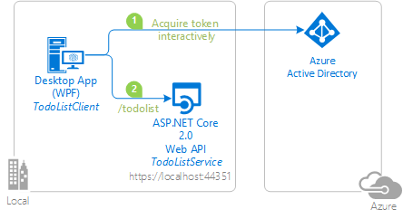

# Calling an ASP.NET Core Web API from a WPF application using Azure AD V2


## About this sample

### Scenario

You expose a Web API and you want to protect it so that only authenticated users can access it. You want to enable authenticated users with both work and school accounts or Microsoft personal accounts (formerly live account) to use your Web API.

Later you enrich your Web API by enabling it to call another Web API such as the Microsoft Graph

### Structure of the repository

This repository contains a progressive tutorial made of two parts:

Sub folder                    | Description
----------------------------- | -----------
[1. Desktop app calls Web API](./1.%20Desktop%20app%20calls%20Web API/Readme.md) | Presents an ASP.NET Core 2.1 Web API protected by Azure AD OAuth Bearer Authentication. This Web API is  exercised by a .NET Desktop WPF application. This subfolder contains a Visual Studio solution made of two applications: the desktop application (TodoListClient), and the Web API (TodoListService) 
[2. Web API now calls Microsoft Graph](./2.%20Web%20API%20now%20calls%20Microsoft Graph/Readme.md)  | Presents an increment where the Web API now calls Microsoft Graph using the on-behalf of flow

> The first part of this sample is  similar to the [active-directory-dotnet-native-aspnetcore](https://github.com/Azure-Samples/active-directory-dotnet-native-aspnetcore) sample except that that one is for the Azure AD V1 endpoint
> and the token is acquired using [ADAL.NET](https://github.com/AzureAD/azure-activedirectory-library-for-dotnet), whereas this sample is for the V2 endpoint, and the token is acquired using [MSAL.NET](https://github.com/AzureAD/microsoft-authentication-library-for-dotnet). The Web API was also modified to accept both V1 and V2 tokens.

### User experience with this sample

The Web API (TodoListService) maintains an in-memory collection of to-do items per authenticated user. Several applications signed-in under the same identities share the same to-do list.

The WPF application (TodoListClient) enables a user to:

- Sign in. The first time a user signs in, a consent screen is presented letting the user consent for the application accessing the TodoList Service and Azure Active Directory.
- When the user has signed-in, the user sees the list of to-do items exposed by Web API for the signed-in identity
- The user can add more to-do items by clicking on *Add item* button.

Next time a user runs the application, the user is signed-in with the same identity as the application maintains a cache on disk. Users can clear the cache (which will also have the effect of signing them out)


## How to run this sample

### Pre-requisites

- Install .NET Core for Windows by following the instructions at [dot.net/core](https://dot.net/core), which will include [Visual Studio 2017](https://aka.ms/vsdownload).
- An Internet connection
- An Azure Active Directory (Azure AD) tenant. For more information on how to get an Azure AD tenant, see [How to get an Azure AD tenant](https://azure.microsoft.com/en-us/documentation/articles/active-directory-howto-tenant/)
- A user account in your Azure AD tenant, or a Microsoft personal account

### Step 1:  Clone or download this repository

From your shell or command line:

```Shell
git clone https://github.com/Azure-Samples/active-directory-dotnet-native-aspnetcore-v2.git
```

> Given that the name of the sample is pretty long, that it has sub-folders and so are the name of the referenced NuGet pacakges, you might want to clone it in a folder close to the root of your hard drive, to avoid file size limitations on Windows.

## Community Help and Support

Use [Stack Overflow](http://stackoverflow.com/questions/tagged/msal) to get support from the community.
Ask your questions on Stack Overflow first and browse existing issues to see if someone has asked your question before.
Make sure that your questions or comments are tagged with [`msal` `dotnet`].

If you find a bug in the sample, please raise the issue on [GitHub Issues](../../issues).

To provide a recommendation, visit the following [User Voice page](https://feedback.azure.com/forums/169401-azure-active-directory).

## Contributing

If you'd like to contribute to this sample, see [CONTRIBUTING.MD](/CONTRIBUTING.md).

This project has adopted the [Microsoft Open Source Code of Conduct](https://opensource.microsoft.com/codeofconduct/). For more information, see the [Code of Conduct FAQ](https://opensource.microsoft.com/codeofconduct/faq/) or contact [opencode@microsoft.com](mailto:opencode@microsoft.com) with any additional questions or comments.

## More information

For more information, visit the following links:

- To lean more about the application registration, visit:

  - [Quickstart: Register an application with the Microsoft identity platform (Preview)](https://docs.microsoft.com/en-us/azure/active-directory/develop/quickstart-register-app)
  - [Quickstart: Configure a client application to access web APIs (Preview)](https://docs.microsoft.com/en-us/azure/active-directory/develop/quickstart-configure-app-access-web-apis)
  - [Quickstart: Quickstart: Configure an application to expose web APIs (Preview)](https://docs.microsoft.com/en-us/azure/active-directory/develop/quickstart-configure-app-expose-web-apis)

- To learn more about the code, visit [Conceptual documentation for MSAL.NET](https://github.com/AzureAD/microsoft-authentication-library-for-dotnet/wiki#conceptual-documentation) and in particular:
  - [Customizing Token cache serialization](https://github.com/AzureAD/microsoft-authentication-library-for-dotnet/wiki/token-cache-serialization)

- Articles about the Azure AD V2 endpoint [http://aka.ms/aaddevv2](http://aka.ms/aaddevv2), with a focus on:
  - [Azure Active Directory v2.0 and OAuth 2.0 On-Behalf-Of flow](https://docs.microsoft.com/en-us/azure/active-directory/develop/active-directory-v2-protocols-oauth-on-behalf-of)

- [Introduction to Identity on ASP.NET Core](https://docs.microsoft.com/en-us/aspnet/core/security/authentication/identity?view=aspnetcore-2.1&tabs=visual-studio%2Caspnetcore2x)
  - [AuthenticationBuilder](https://docs.microsoft.com/en-us/dotnet/api/microsoft.aspnetcore.authentication.authenticationbuilder?view=aspnetcore-2.0)
  - [Azure Active Directory with ASP.NET Core](https://docs.microsoft.com/en-us/aspnet/core/security/authentication/azure-active-directory/?view=aspnetcore-2.1)
